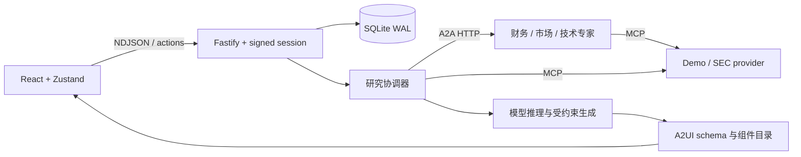

# 智研工作台 · A2UI Research Workspace

面向公司研究的全栈 AI 应用。React 渲染受约束的 A2UI 卡片，Fastify 编排研究任务；A2A 专家通过 MCP 获取事实，模型解释数据并生成可交互研究界面。支持连续研究、卡片追问、任务草稿、停止和刷新恢复。

本项目采用规则驱动的技能路由及固定专家集合。财务专家可调用模型进行推理，市场和技术专家主要整理数据；这不是完全自主规划的多 Agent 系统。

## 启动

使用 Node.js 24.13+（24.x）与 npm，统一维护 package-lock.json。

```sh
npm ci
cp .env.example .env
# 在 .env 填入 DEEPSEEK_API_KEY / Set DEEPSEEK_API_KEY in .env
npm run dev
```

Windows PowerShell 使用 `Copy-Item .env.example .env`。浏览器打开 http://localhost:5173；生产构建由同一个 Fastify 服务提供。

```sh
npm run build
npm start
```

默认模型由 DEEPSEEK_MODEL 指定，可改成账户可用模型。没有密钥时数据工具仍可工作，但生成研究界面会明确报错。自动验收使用独立模型夹具，不需要密钥。

## 数据能力与边界

| 配置 | 能力 | 不包含 |
| --- | --- | --- |
| RESEARCH_PROVIDER=demo | 六家公司的固定示例，财务、市场、技术流程均可演示 | 实时性、投资结论有效性 |
| RESEARCH_PROVIDER=sec | SEC 公司检索、US-GAAP 年度营收、利润率、现金流及历史披露；展示来源 URL、报告期和获取时间 | 实时行情、估值、新闻、技术研究；未支持的披露会报错 |

SEC 模式需要将 SEC_USER_AGENT 填为自己的项目名和真实联系邮箱。使用最新披露的同报告期数值，排除累计季度，缺失指标保留缺失，不填零。数据缓存 6 小时，请求限速。公司更名、会计口径变更仍需人工核对，历史值可能包含重述。

当前开发环境对 SEC 的真实请求返回 HTTP 403，因此只完成了映射逻辑验收，尚未验证该环境的真实数据全链路。接口拒绝访问会显示错误，不会切换成演示数据。SEC 只能支持财务维度，其他专家缺失会直接显示在结果上方。

## 架构与关键取舍



- 模型只能生成受控研究组件，服务端拥有表单和交互组件；不执行模型输出的 JavaScript。
- SQLite 保存研究任务、交互状态、每次运行和事件。任务通过条件 UPDATE 领取；已运行或完成的任务不会再次调用模型。完成结果可重新打开。
- 状态流转：DRAFT → SUBMITTED → RUNNING → COMPLETED / FAILED / CANCELLED；失败和取消可以显式重试。服务重启将中断任务标记失败，不会自动重复收费调用。
- 客户端停止和连接断开传播 AbortSignal 到模型与 A2A 请求。NDJSON 提前结束与解析失败不会被当作成功。
- 每轮会话保留独立结果；刷新重放已保存事件。清空会话保留研究任务。表单与追问仅能操作当前签名会话拥有的 surface。
- 部分专家失败时保留已完成维度，明确列出缺失内容。全部没有可用数据时不能编造完整研究。
- 部署访问口令保护入口，HttpOnly 签名 Cookie 隔离浏览器会话；限制登录频率和工作台每日操作总量（UTC 零点重置，清空会话不会重置）。内部 A2A 端点需要服务令牌。

这是单进程部署方案：浏览器 Cookie 是持久身份，不提供账号恢复；清除 Cookie 后原会话无法找回。开发环境未设置访问口令时使用本机共享身份。多副本需要独立任务队列与共享身份服务，当前不应直接水平扩容。

## 部署

设置 APP_ACCESS_KEY、随机长字符串 SESSION_SECRET、PUBLIC_ORIGIN=https://你的域名，以及模型密钥。保持 SESSION_SECRET 不变才能在重启后继续读取原会话。

```sh
docker compose up --build -d
```

Docker 使用非 root 用户、持久数据卷和健康检查。容器只将端口映射到宿主机 127.0.0.1:3001，使用自己的 HTTPS 反向代理暴露服务；代理需关闭响应缓冲，并将读取超时设为至少 300 秒。生产 Cookie 要求 HTTPS，PUBLIC_ORIGIN 必须与浏览器来源一致。

备份时先停止服务，备份 research-data 卷，再启动；本地默认数据目录为 .data。旧 research-jobs.json 的草稿自动导入本机身份且保留原文件。更改为生产隔离身份后不会自动把本机数据公开给访客。

仓库提供部署配置；尚未在目标服务器执行 Docker 部署。

## 一次集中验收

```sh
npx playwright install chromium
npm run verify
```

verify 包含类型检查、单元与协议测试、生产构建、lint 和 5 条浏览器流程。已有 Edge 的 Windows 可设置 `$env:PLAYWRIGHT_CHANNEL='msedge'`。E2E 的服务端、SQLite 目录和模型夹具与实际开发配置分离，验证正常研究、追问、刷新、任务保存与执行、重复启动、专家失联、停止及非法模型输出。失败保留 trace，不做自动重试。

GitHub Actions 在 main、当前开发分支和所有 PR 上运行相同检查。

## 面试演示与评估

建议按顺序演示：分析 NVIDIA 财务 → 点击营收追问 → 新增 AMD 研究并刷新 → 创建深度研究草稿 → 保存、提交、执行 → 重开完成任务 → 展开来源与执行过程。对方可以观察真实协议调用和持久化，而不必只看静态页面。

准备了 eval/cases.json 中 24 个固定问题，覆盖比较、缺失数据、财务与多维研究。在有真实模型密钥、服务已启动时显式运行：

```sh
npm run eval
```

如果设置了访问口令，运行评估进程前也设置 APP_ACCESS_KEY 环境变量；EVAL_BASE_URL 可覆盖默认本地地址。每个问题分别运行 single（协调器直接 MCP）和 multi（专家编排），共 48 次研究请求，产生实际模型费用。

结果保存在 .data/evaluations/latest.json，记录首个研究组件耗时、总耗时、调用次数、token、协议完成状态、来源链接和原始事件。先区分成功、正确澄清、正确拒答与错误，再人工核对关键数字、引用是否支持结论及维度覆盖。仅有 done 或来源链接不能证明答案正确；成本需按实际模型价格及缓存命中情况计算。

尚未运行真实模型的对照评估，不能声称多 Agent 提升了准确率或降低成本。固定夹具验证工程流程，不作为模型效果证据。
